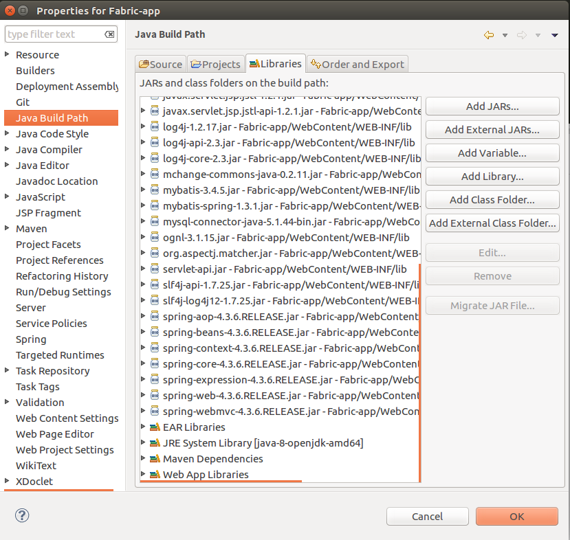
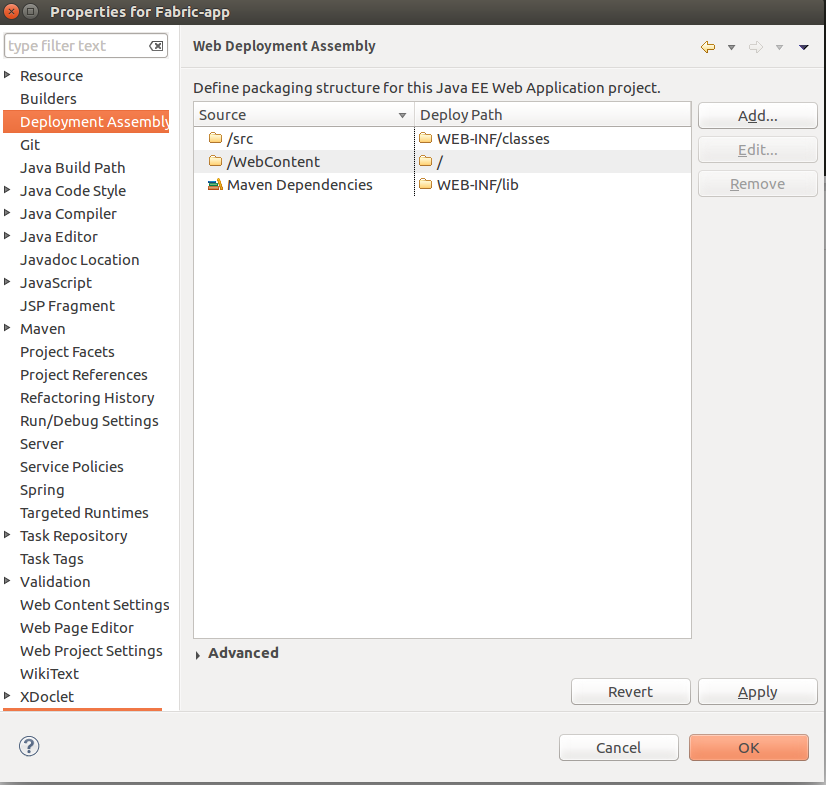
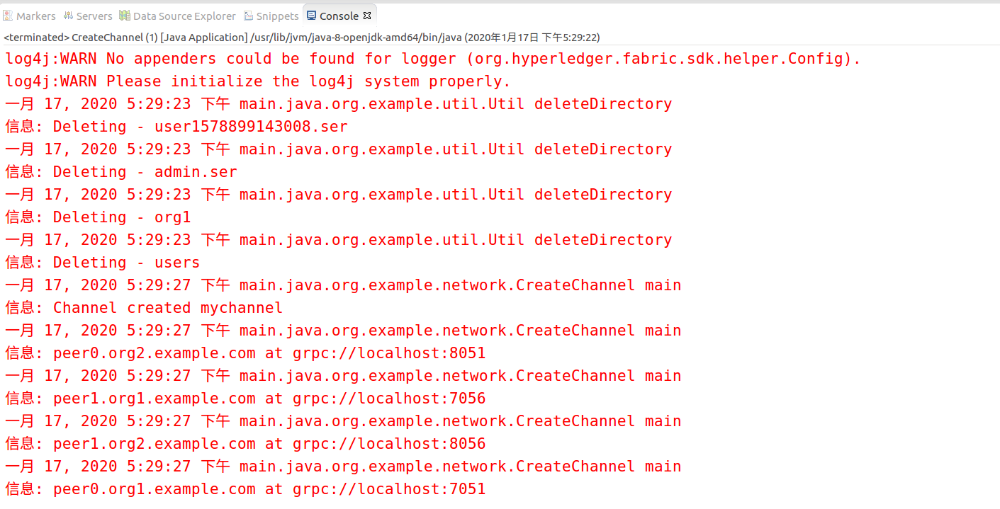
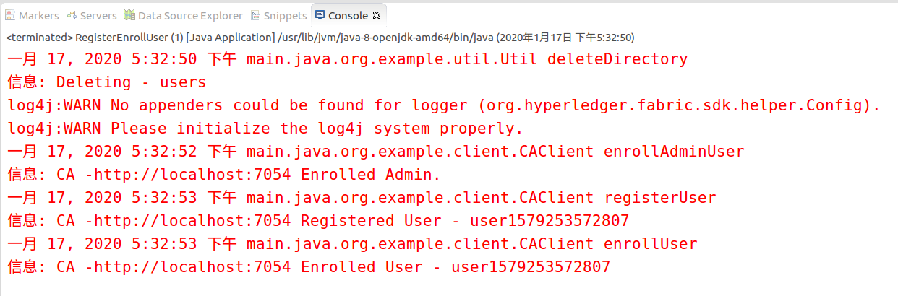
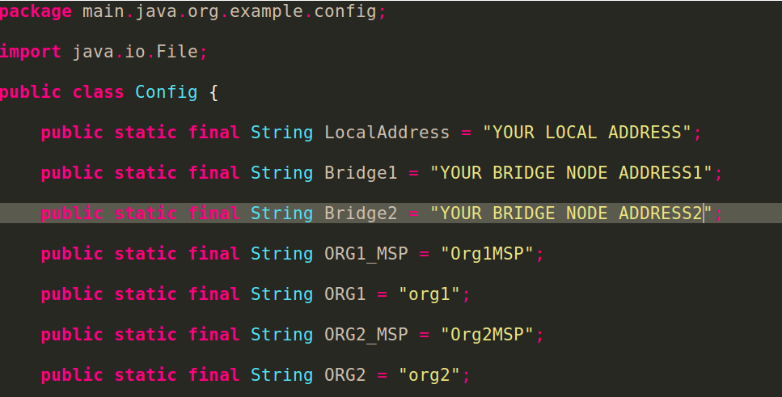
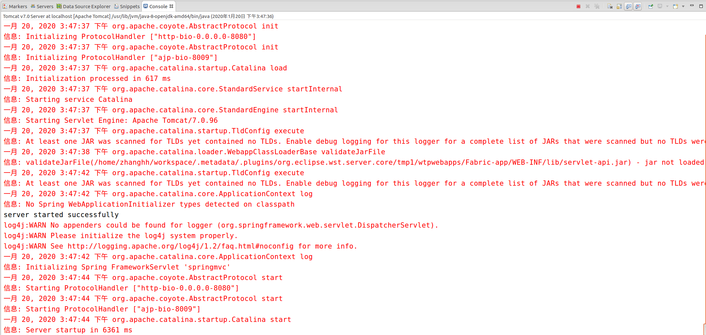
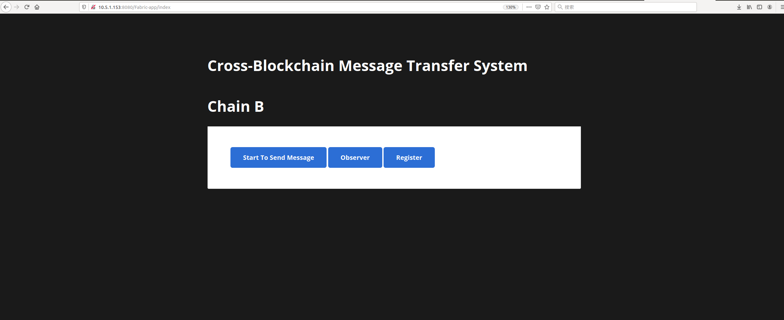

# Create and Deploy a Blockchain APP using Hyperledger Fabric SDK Java


## Included Components

* [Hyperledger Fabric](https://hyperledger-fabric.readthedocs.io/): Hyperledger Fabric is a platform for distributed ledger solutions underpinned by a modular architecture delivering high degrees of confidentiality, resiliency, flexibility and scalability.

* [Docker](https://www.docker.com/): Docker is an open platform for developers and sysadmins to build, ship, and run distributed applications.

* [Hyperledger Fabric Java SDK](https://github.com/hyperledger/fabric-sdk-java)


## Pre-requisites

* [Docker](https://www.docker.com/get-started) 
* [Docker Compose](https://docs.docker.com/compose/overview/)
* [Git Client](https://git-scm.com/downloads) - needed for clone commands
* [Maven](https://maven.apache.org/download.cgi) - needed to build the client. Maven is a build automation tool used primarily for Java projects. Maven addresses two aspects of building software: first, it describes how software is built, and second, it describes its dependencies.
* [Eclipse](https://www.eclipse.org/downloads/packages/release/kepler/sr2/eclipse-ide-java-ee-developers)
* [Tomcat](https://tomcat.apache.org/download-70.cgi)
## Steps

Follow these steps to setup and run this code pattern.

1. [Setup the Blockchain Network](#1-setup-the-blockchain-network)
2. [Build the APP based on Fabric Java SDK](#2-build-the-client-based-on-fabric-java-sdk)
3. [Create and Initialize the channel](#3-create-and-initialize-the-channel)
4. [Deploy and Instantiate the chaincode](#4-deploy-and-instantiate-the-chaincode)
5. [Register and enroll users](#5-register-and-enroll-users)

### 1. Setup the Blockchain Network

[Clone this repo](http://10.6.55.124/bigdata/ard230/tree/haihua/Fabric-app) to your local repository.

> **Note:** Please clean up the old docker images (if any) from your environment otherwise you may get errors while setting up network.

   ```
   cd network
   chmod +x build.sh
   ./build.sh
   ```
   

To stop the running network, run the following script.

   ```
   cd network
   chmod +x stop.sh
   ./stop.sh
   ```

To delete the network completely, following script need to execute.

   ```
   cd network
   chmod +x teardown.sh
   ./teardown.sh
   ```
Execute build.sh.

   ```
   ./build.sh
   ```

Output:

### 2. Build the client based on Fabric Java SDK

The previous step creates all required docker images with the appropriate configuration.
To work with the deployed network using Hyperledger Fabric SDK java 1.4.1, perform the following steps.

* Open Eclipse and import this project as a dynamic-web project, using maven to manage the libs.



### 3. Create and Initialize the channel

In Eclipse, run file main.java.org.example.network.CreateChannel as a normal java application.

Output:



### 4. Deploy and Instantiate the chaincode

After creating the channel, we need to deploy and initiate chaincode on each peer.
Run file file main.java.org.example.network.DeployInstantiateChaincode as a normal java application.

Output:
```
Setting up the Hyperledger Fabric 1.1 network
Creating network "network_custom" with the default driver
Creating orderer.example.com ... 
Creating ca_peerOrg1 ... 
Creating ca_peerOrg2 ... 
Creating orderer.example.com
Creating ca_peerOrg1
Creating orderer.example.com ... done
Creating peer1.org1.example.com ... 
Creating peer0.org1.example.com ... 
Creating peer0.org2.example.com ... 
Creating peer1.org2.example.com ... 
Creating peer1.org1.example.com
Creating peer0.org1.example.com
Creating peer1.org2.example.com
Creating peer0.org2.example.com ... done

Network setup completed!!
```

   > **Note:** The chaincode fabcar.go is a offiacial template, now is edited as a message encryption and decryption chaincode, which is in Fabric-app/network_resource/chaincode/src/github.com/fabcar.

### 5. Register and enroll users

A new user can be registered and enrolled to an MSP. 
Execute the file main.java.org.example.network.RegisterEnrollUser to register a new user and enroll to Org1MSP.

Output:



### 6. Start the server

Before start the server, you should configure your IP address.
Open main.java.org.example.config.Config, and replace the relevant variables by your local and bridge IP addresses.


Use Eclipse, run project Fabric-app as a server on tomcat 7.0.

Output:



### 7. Open the web client.

Input http://YOUR IP ADDRESS/Fabric-app/index in address bar.

Output:


